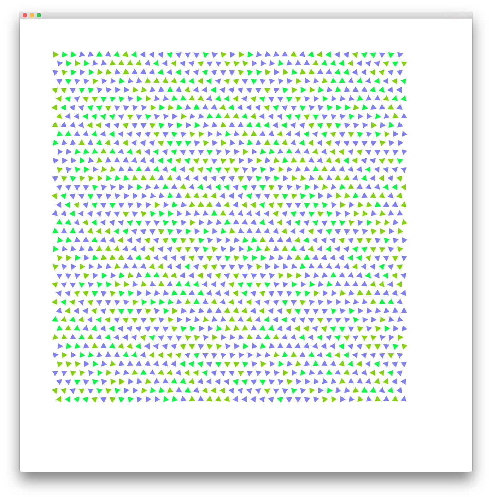
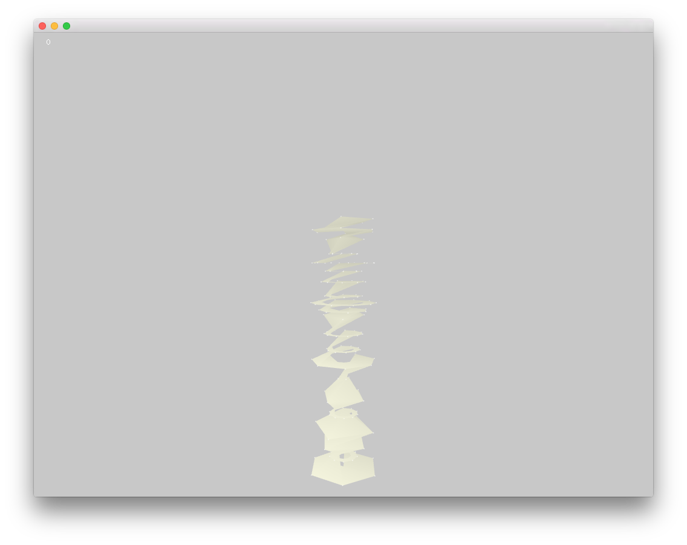
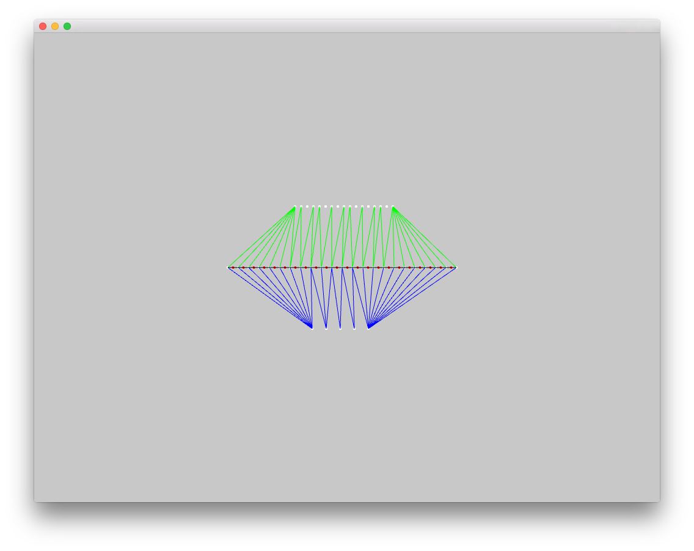

#Patterns Project

##TriangleMan

##Vases

#vectorTree
See [Structures Redux](http://cameronbrowning.com/content/structures-redux/) on cameronbrowning.com

#gatorTeeth
A test application for figuring out how to tesselate latitude slices (for the Vases appliction)
